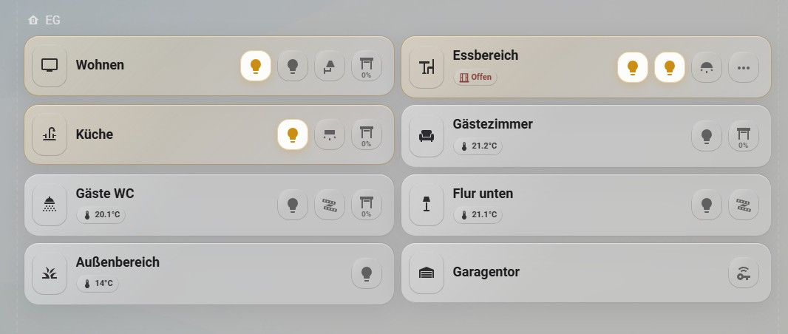
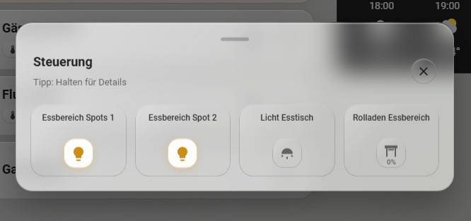
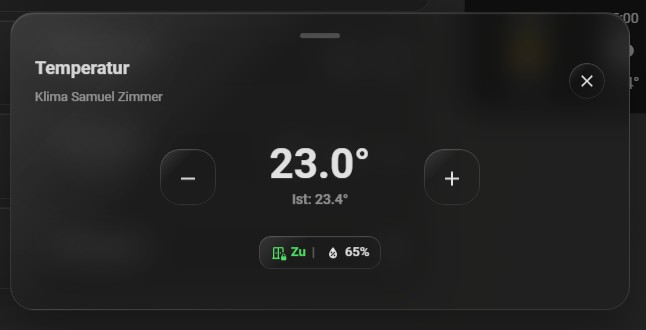

# 🌟 Smarvy Area Card für Home Assistant


Willkommen zur **Smarvy Area Card** – einer hochperformanten, responsiven und visuell atemberaubenden Custom Card für dein Home Assistant Dashboard. 

Entwickelt mit einem extremen Fokus auf **Mobile-First UX**, bringt diese Karte Premium-Design (Glassmorphism) und native Pop-ups direkt in dein Smart Home, **ganz ohne externe Abhängigkeiten wie `browser_mod`**.

---

## ✨ Highlights & Features

* 🎨 **Premium Glassmorphism Design:** Moderne Blur-Effekte, dynamische "Shimmer"-Verläufe und native Anpassung an helle und dunkle Themes.
* 📱 **Touch-Optimiert & Gestensteuerung:** * **Long-Press:** Haptisches Feedback und visuelle "Veil"-Ladebalken beim gedrückt Halten.
  * **Swipe-to-Close:** Schließe das integrierte Pop-up elegant mit einer Wischgeste nach unten.
* ⚡ **Zero Dependencies (Kein browser_mod!):** Das Pop-up-System ist zu 100 % in der Karte integriert. Ein Skript, alles funktioniert.
* 🌡️ **Smarte Klima- & Sensor-Integration:**
  * Platzsparende "Badges" für Temperatur, Luftfeuchtigkeit und offene/geschlossene Fenster direkt auf der Hauptkarte.
  * Dediziertes Klima-Pop-up zur schnellen Steuerung deines Thermostats.
* 💡 **Intelligenter "Master Off":** Halte die Hauptkarte gedrückt, um sofort alle aktiven Lichter, Schalter oder Ventilatoren in diesem Raum auszuschalten.
* ⚙️ **Vollwertiger visueller Editor:** Konfiguriere alles bequem über die Home Assistant UI. Inklusive nativem Drag & Drop zum Sortieren deiner Geräte-Buttons!

---

## 🚀 Installation

Da diese Karte als reines Vanilla-JavaScript geschrieben ist, ist die Installation extrem simpel.

### HACS
1. Gehe auf HACS in deinem Home Assistant
2. Klicke oben rechts auf die 3 Punkte -> Benutzerdefinierte Repositories
3. In der Zeile "Repository" den Link  https://github.com/AlexWithRelax/smarvy-area-card.git  einfügen, "Typ" auf "Dashboard" stellen und Hinzufügen
4. Oben in der Suchleiste "Smarvy Area Card" eingeben -> Auswählen und Herunterladen

### Manuelle Installation

1. Lade die Datei `smarvy-area-card.js` herunter.
2. Lege die Datei in deinem Home Assistant Verzeichnis unter `/config/www/` ab (erstelle den Ordner `www`, falls er noch nicht existiert).
3. Gehe in Home Assistant zu **Einstellungen** > **Dashboards** > Oben rechts auf die drei Punkte > **Ressourcen**.
4. Klicke auf **Ressource hinzufügen**:
   * **URL:** `/local/smarvy-area-card.js`
   * **Ressourcentyp:** `JavaScript Modul`
5. Lade dein Browser-Fenster neu (F5 oder Cache leeren).
6. Gehe in dein Dashboard, klicke auf "Karte hinzufügen" und suche nach **Smarvy Area Card**.

---

<details>
<summary>🛠️ <b>Konfiguration (Hier klicken)</b></summary>

Die Smarvy Area Card bringt einen maßgeschneiderten, visuellen Editor mit. Du kannst alle Farben, Entitäten und Buttons bequem über die Benutzeroberfläche zusammenklicken. 

Für Nutzer, die lieber YAML schreiben, hier ein Beispiel der Konfiguration:

```yaml
type: custom:smarvy-area-card
name: Essbereich
icon: mdi:table-chair
temp_entity: sensor.temperatur_essbereich
humidity_entity: ""
window_entity: binary_sensor.türsensor_essbereich
climate_entity: climate.essbereich
nav_path: /home/areas-essbereich
cover_invert: true
dark_text: false
show_door_closed: false
color_on: ""
color_on_dark: ""
color_cover: ""
color_cover_dark: ""
color_door_open: ""
color_door_open_dark: ""
color_door_closed: ""
color_door_closed_dark: ""
max_buttons: 2
buttons:
  - entity: light.essbereich_spots_1
    icon: mdi:lightbulb
    type: entity
  - entity: cover.rolladen_essbereich
    icon: mdi:window-shutter
    type: entity
  - entity: light.essbereich_spots_2
    icon: mdi:lightbulb
    type: entity
  - entity: light.licht_esstisch
    icon: mdi:wall-sconce-round
    type: entity
```
</details>

---

<details>
<summary>🎨 <b>Design & Farben anpassen (Hier klicken)</b></summary>

Du kannst die Farben (Hex-Codes) für aktive Geräte, Rollläden und Fensterzustände (offen/geschlossen) direkt im visuellen Editor überschreiben, um sie perfekt an dein Theme anzupassen.
</details>

---

<details>
<summary>🎮 <b>Bedienung & Gesten (Hier klicken)</b></summary>

Die **Smarvy Area Card** wurde für ein haptisches und visuelles Premium-Erlebnis entwickelt. Sie kombiniert intuitive Gesten mit direktem Feedback, wie man es von modernen High-End-Interfaces kennt.

### 📳 Visuelles & Haptisches Feedback (Premium Feel)
Um Fehlbedienungen zu vermeiden und eine wertige Haptik zu garantieren, nutzt die Karte zwei besondere Mechanismen:

* **Der "Schleier-Effekt" (Visual Shroud):** Bei jedem Halten (**Long Press**) breitet sich ein sanfter, dunkler Schleier über die gesamte Karte aus. Die Aktion (z. B. der Master Off) wird erst ausgelöst, wenn der Schleier die Karte vollständig "eingehüllt" hat. Dies signalisiert dir visuell den Fortschritt der Aktivierung.
* **Haptisches Feedback:** Auf touchfähigen Geräten mit Vibrationsmotor (Smartphones & Tablets) erhältst du eine kurze, präzise Vibration, sobald der Long-Press-Befehl erfolgreich registriert wurde.
   
Hier ist ein kurzer Überblick, wie du das Maximum aus deinem Dashboard herausholst:

### 🏠 Hauptbereich (Links & Mitte)
* **Tippen auf das Raum-Icon (links):** Führt keine Interaktion aus.
* **Halten auf das Raum-Icon (Long Press):** **Master Off** – Schaltet sofort alle aktiven Lichter, Schalter und Ventilatoren im Raum aus.
* **Tippen auf den Raumnamen:** Navigiert dich direkt zum hinterlegten Pfad (zb. Areas).
* **Halten auf den Raumnamen/Sensoren:** Öffnet direkt das **Klima-Pop-up**, falls ein Thermostat konfiguriert ist.
* **Im **Klima-Pop-up** = **Halten auf die Temperatur:** Öffnet den Standard-Home-Assistant-Dialog für detaillierte Einstellungen des Klimagerätes.

### 💡 Geräte-Buttons (Rechts)
* **Einfaches Tippen:** Schaltet das Gerät ein/aus (Licht, Fan, Switch) oder steuert den Rollladen (Öffnen/Stopp/Schließen).
* **Halten (Long Press):** Öffnet den Standard-Home-Assistant-Dialog für detaillierte Einstellungen (z. B. Farbe des Lichts).
* **Drei Punkte (⋮) - Tippen:** Öffnet das **Steuerungs-Pop-up** mit allen weiteren Geräten des Raums.
* **Drei Punkte (⋮) - Halten:** **Quick Off** – Schaltet nur die im Pop-up versteckten Geräte aus.

### 🌡️ Pop-up & Klima-Steuerung
* **Temperatur anpassen:** Nutze die **+** und **-** Tasten im Klima-Pop-up für schnelle Änderungen.
* **Ist-Temperatur:** Die Karte zeigt dir im Badge und im Pop-up immer die aktuelle Ist-Temperatur sowie die Luftfeuchtigkeit an.
* **Schließen:** Du kannst das Pop-up jederzeit durch eine **Wischgeste nach unten** (Swipe down), beim daneben Klicken auf dem Bildschirm oder durch Tippen auf das "X" schließen.
</details>

---

<details>
<summary>🏗️ <b>Bekannte Einschränkungen & Roadmap (Hier klicken)</b></summary>

### Light Mode & Glassmorphism
Der **Premium Glassmorphism-Effekt** ist aktuell für den **Dark Mode** optimiert. 

* **Status:** Im hellen Systemdesign wird der Glassmorphism (Glaseffekt) derzeit nicht gerendert.
* **Ziel:** Ich arbeite an einer Lösung für "Light-Glassmorphism"!

### Geplante Features
* [ ] Media Integeation 
* [ ] Klima Funktion erweitern
</details>

---

<details>
<summary>🤝 <b>Über den Entwickler (Hier klicken)</b></summary>

Dieses Projekt wird entwickelt und gepflegt von **[Smarvy](https://smarvy.de)**. 

Planung, Einrichtung und Optimierung von Smart-Home-Systemen, auf Basis von Home Assistant. Intergrierung von Shelly, KNX, HomematicIp, Zigbee usw. in das Home Assistant.
Wenn du dein Smart Home auf das nächste Level heben möchtest oder Unterstützung bei einem komplexen Projekt brauchst, schau auf meiner Website vorbei!

> **Dir gefällt diese Karte?**
> Empfiehl uns weiter oder lass mich wissen, wie du sie in deinem Dashboard einsetzt!
</details>

---

### ❤️ Unterstütze das Projekt

Dir gefällt die **Smarvy Area Card**? Die Entwicklung und Wartung solcher Karten steckt voller Herzblut und Zeit. Wenn du meine Arbeit unterstützen möchtest, freue ich mich riesig über einen virtuellen Kaffee oder eine kleine Spende!

[](https://buymeacoffee.com/alexwithrelax)
[](https://www.paypal.me/alexbensel)

Vielen Dank für deinen Support! 🙏

---

### 📸 Screenshots







---

*Lizenz: Nutzung für private Home Assistant Dashboards freigegeben.*
